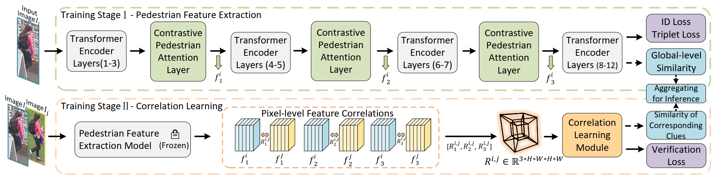

The *official* repository for [Contrastive Pedestrian Attentive and Correlation Learning Network for Occluded Person Re-Identification](https://ieeexplore.ieee.org/abstract/document/10476489/) (published in IEEE TCSVT 2024) achieves state-of-the-art performances on occluded person re-ID datasets.


## Pipeline




## Requirements

### Installation

```bash
pip install -r requirements.txt
(we use /torch 1.6.0 /torchvision 0.7.0 /timm 0.3.2 /cuda 10.1 / 16G or 32G V100 for training and evaluation.
Note that we use torch.cuda.amp to accelerate speed of training which requires pytorch >=1.6)
```

### Prepare Datasets

```bash
mkdir datasets
```

Download the person dataset [Occluded-Duke](https://github.com/lightas/Occluded-DukeMTMC-Dataset), and Occluded-REID
Then unzip them and rename them under the directory like

```
data
├── Occluded_Duke
│   ├── bounding_box_train
│   ├── bounding_box_test
│   └── query


```

## Training

We utilize 2 GPUs for training.

```bash
sh dist_train_occDuke.sh
```

**or you can directly train with following  yml and commands:**

## Evaluation

```bash
sh dist_test_occDuke.sh
```

For evaluation only, you could download our trained model from [Google](https://drive.google.com/file/d/1u-U6H7p3DLamGnSHajWAr8HP_WuzXyNY/view?usp=sharing)
The pretrained model and other files can also be downloaded from [Google](https://drive.google.com/drive/folders/16XO1d7Ce52SP4FI_3UkRyEyXOKmW4k3U?usp=sharing)

## Acknowledgement

Codebase from [TransReID](https://github.com/damo-cv/TransReID)

<!-- 
## Citation

If you find this code useful for your research, please cite our paper

```
@InProceedings{He_2021_ICCV,
    author    = {He, Shuting and Luo, Hao and Wang, Pichao and Wang, Fan and Li, Hao and Jiang, Wei},
    title     = {TransReID: Transformer-Based Object Re-Identification},
    booktitle = {Proceedings of the IEEE/CVF International Conference on Computer Vision (ICCV)},
    month     = {October},
    year      = {2021},
}
``` -->

<!-- ## Contact

If you have any question, please feel free to contact us. E-mail: [shuting_he@zju.edu.cn](mailto:shuting_he@zju.edu.cn) , [haoluocsc@zju.edu.cn](mailto:haoluocsc@zju.edu.cn) -->

